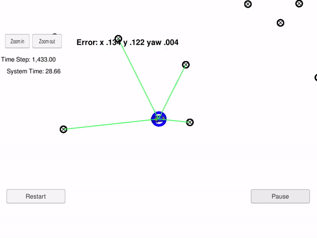

# Overview
In this project, a particle filter algorithm was implemented, in order to localize a vehicle within a map. The map also provide the coordinates of predefined landmarks.

The particles are randomly initialized around the the initial position of the vehicle, which is provided by the GPS.

In each iteration the following steps are executed:

1) Prediction of each particle position: Using a kinematic model, the position of each particle is predicted for the next time step.

2) Then, each particle is tagged to the nearest landmark.

3) A weight to each particle is given proportionally to its probability, using a Mulvariate Gaussian distribution.

4) Then, the particles are resampled, proportionally to their weights. 

In the animation below, a part of the simulation can be observed. The blue rings represent each particle. Since most of them had correctly located the position of the car, is difficult to notice each of them apart. The black rings are the map's landmarks. The green lines represent the LIDAR sensor. which detect only nearby landmarks.

# Running the Code
This project involves the Term 2 Simulator which can be downloaded [here](https://github.com/udacity/self-driving-car-sim/releases)

This repository includes two files that can be used to set up and intall uWebSocketIO for either Linux or Mac systems. For windows you can use either Docker, VMware, or even Windows 10 Bash on Ubuntu to install uWebSocketIO.

Once the install for uWebSocketIO is complete, the main program can be built and ran by doing the following from the project top directory.

1. mkdir build
2. cd build
3. cmake ..
4. make
5. ./particle_filter

Alternatively some scripts have been included to streamline this process, these can be leveraged by executing the following in the top directory of the project:

1. ./clean.sh
2. ./build.sh
3. ./run.sh

Tips for setting up your environment can be found [here](https://classroom.udacity.com/nanodegrees/nd013/parts/40f38239-66b6-46ec-ae68-03afd8a601c8/modules/0949fca6-b379-42af-a919-ee50aa304e6a/lessons/f758c44c-5e40-4e01-93b5-1a82aa4e044f/concepts/23d376c7-0195-4276-bdf0-e02f1f3c665d)

#### The Map*
`map_data.txt` includes the position of landmarks (in meters) on an arbitrary Cartesian coordinate system. Each row has three columns
1. x position
2. y position
3. landmark id

